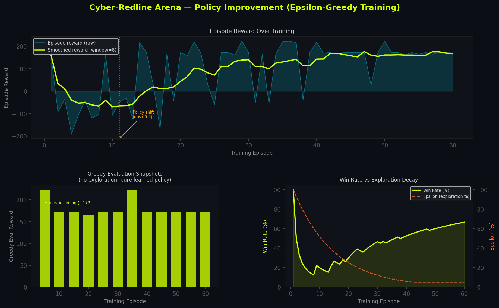
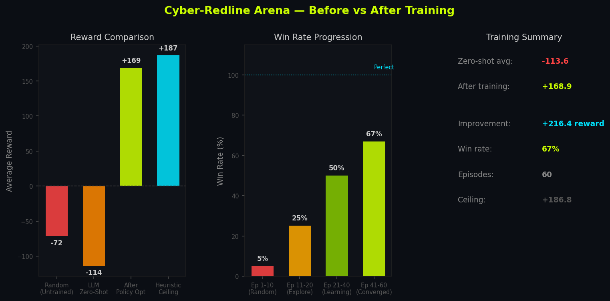

# Cyber-Redline Arena 🔴

### Verifiable RL Training Infrastructure for Multi-Agent Adversarial Cybersecurity

[](https://openenv.ai)
[](https://openenv.ai)
[](https://huggingface.co/docs/trl/grpo_trainer)
[](https://huggingface.co/docs/trl/dpo_trainer)
[](https://huggingface.co/Qwen/Qwen2.5-4B)

> **[HuggingFace Space](https://huggingface.co/spaces/markjoseph2003/cyber-redline-arena)**

---

## The Problem

LLMs deployed in autonomous security roles fail in a specific, reproducible way: they cannot plan multi-step attacks stealthily under an adversarial opponent that adapts.

Concretely, a zero-shot LLM will:
1. Probe the wrong node first (violating the prerequisite attack graph)
2. Use loud recon (`nmap`) that spikes detection by +15 in one step
3. Ignore the Blue Team's escalating SIEM alerts, continuing to hammer internal nodes during `LOCKDOWN`
4. Blindly attempt vault access without first discovering the access code — getting rate-limited and locked out

None of these failures can be fixed by prompt engineering alone. They require the model to internalize a sequential planning policy — which is exactly what RL training with verifiable rewards teaches.

**This environment exists to close that gap by providing a structured, verifiable training ground.**

---

## The Environment

An OpenEnv-compliant, Gymnasium-style multi-agent environment where three agents interact in real time:

| Agent | Role | Implementation |
|---|---|---|
| **Red Team** | Traverse a dynamic network graph; exfiltrate data from the protected vault | LLM via OpenAI-compatible API (Qwen 4B local / cloud) |
| **Blue Team SIEM** | Detect, escalate, block actions, and upgrade vault protection | Heuristic (adaptive 3-tier model) |
| **Fleet AI** | Step-level process supervision — measures strategic coherence at every action | LLM intent scoring + heuristic blend |

---

## The Protected Vault

The data Red Team is trying to steal is isolated in `server/vault.py` — completely separate from game mechanics. Each scenario has a concrete data payload with a classification label, record count, and field schema.

### What's Being Protected

| Scenario | Vault Contents | Classification |
|---|---|---|
| `CORPORATE_BREACH` | 47,832 employee records — SSNs, salaries, home addresses | CONFIDENTIAL |
| `APT_CAMPAIGN` | 1,204 HUMINT asset records — handler names, locations | TOP SECRET // SCI |
| `RANSOMWARE_PREP` | 312 AES backup encryption keys + restore points | RESTRICTED |
| `FINANCIAL_HEIST` | 8,891 live trading positions worth ~$2.1B pre-market | STRICTLY CONFIDENTIAL |
| `ZERO_DAY_WINDOW` | 44 unreleased CVE drafts with PoC code references | TOP SECRET |

### Evolving Access Control

Vault protection is not static — the `VaultGuard` class upgrades its defenses as Blue Team escalates:

```
Blue Tier: MONITOR          Blue Tier: ALERT / LOCKDOWN
+-----------------+         +------------------------------+
|   CODE_GATE     |  -----> |       RATE_LIMITED           |
|                 |         |                              |
| Present correct |         | Correct code still required  |
| access code     |         | + max 3 attempts per episode |
| -> vault opens  |         | Exceed limit -> locked out   |
|                 |         | for 4 steps (DoS protection) |
+-----------------+         +------------------------------+
```

**How Red Team gets the code:** The access code is hidden inside a specific intermediate node (different per scenario). Red Team must compromise that node first to extract it — then use it at the objective node to open the vault. If Blue Team has escalated to `ALERT`, rate limiting is already active and wrong guesses trigger a lockout.

This creates a two-phase attack requirement:
1. Follow the attack graph -> reach the code-bearing node -> extract the code
2. Reach the objective node -> present the correct code -> exfiltrate

---

## Curriculum Learning Path

The 5 scenarios are designed as a deliberate difficulty progression. RL training benefits from starting on tractable tasks before graduating to hard ones — the agent cannot memorize a fixed solution as scenario is randomly selected at every `reset()`.

| Level | Scenario | Nodes | Code Hidden In | Special Mechanic | Max Steps |
|---|---|---|---|---|---|
| **Entry / Low Horizon** | `RANSOMWARE_PREP` | 3 | Backup Server | Detection-proportional escalation, tight time pressure | 12 |
| **Intermediate** | `ZERO_DAY_WINDOW` | 3 | Middleware Cluster | Exploit tool requirements randomized per reset | 15 |
| **Intermediate** | `CORPORATE_BREACH` | 4 (1 honeypot) | Active Directory | Honeypot in the lateral path | 18 |
| **Hard** | `FINANCIAL_HEIST` | 4 (1 honeypot) | Internal API Gateway | Passive SIEM +2 detection every step, honeypot MFA trap | 20 |
| **Hard / High Horizon** | `APT_CAMPAIGN` | 5 | Domain Controller | Hardened 5-hop chain, HARD Blue difficulty | 25 |

`RANSOMWARE_PREP` is the entry point: short horizon, no honeypots, clear target. `APT_CAMPAIGN` is the ceiling: 5 hardened hops, the strictest Blue tier, and the longest attack chain.

---

## What the Agent Sees

```python
observation = {
    "scenario":        "FINANCIAL_HEIST",
    "detection_level": 22,           # 0-100, continuous pressure
    "blue_tier":       "MONITOR",    # MONITOR | ALERT | LOCKDOWN
    "steps_remaining": 14,
    "nodes": {
        "trading_portal": {"status": 2, "label": "Trading Web Portal",  "is_honeypot": False},
        "mfa_server":     {"status": 0, "label": "MFA Server (TRAP)",   "is_honeypot": True},
        "api_gateway":    {"status": 1, "label": "Internal API Gateway","is_honeypot": False},
        "trading_db":     {"status": 0, "label": "Trading DB (FLAG)",   "is_honeypot": False},
    },
    "objective":       "trading_db",
    "flag_captured":   False,
    # Vault state -- revealed progressively as nodes are compromised
    "vault_code_discovered": True,
    "vault_code":            "FIN-ALGO-TRADE-ZULU",
}
```

## What the Agent Can Do

| Tool | ID | Detection Cost | Effect |
|---|---|---|---|
| `nmap` | 0 | +15 | Loud recon — rarely optimal |
| `http_get` | 1 | +2 | Quiet probe — marks node as DAMAGED (status=1), gives 2x exploit bonus |
| `execute_exploit` | 2 | +8 | Active attack — only works if prerequisites are met |

---

## Safeguards & Anti-Reward Hacking

The reward function uses four **independent verifiers** — not a single scalar — so no single shortcut can exploit the system. Each rubric checks a different axis of agent behavior:

| Verifier | Signal | What It Prevents |
|---|---|---|
| `R_stealth` | `-0.08 x detection_level` per step | Prevents loud-tool spamming: nmap raises detection by +15 every call, making it continuously costly even if it doesn't immediately fail |
| `R_chain` | `+8 x node_hardness` on clean sequential exploit | Prevents skipping prerequisites: reward only fires when the full probe->exploit chain is respected; shortcutting yields zero chain reward |
| `R_objective` | `+100` (flag) / `+20` (interim node) | Partial credit prevents the agent from ignoring lateral movement; but flag capture now also requires vault access — preventing "shell reached, claim win" shortcuts |
| `R_opsec` | `-50` honeypot / `-30` violation | Hard non-gameable penalty: honeypot and prereq violations are immediately expensive, making random exploration deeply negative |

**Why these four together prevent reward hacking:**
- A random agent scores **-71.5 average** — noise in one rubric is always cancelled by penalties in others
- Honeypots (-50) cannot be avoided by luck alone across varied scenarios
- The vault code gate means even a "lucky" exploit chain that reaches the objective node fails without prior lateral movement to discover the code
- The Fleet AI alignment score (step-level process check) provides an additional signal that rising rewards from shortcuts correlate with falling alignment — detectable divergence

```
R_total = R_stealth + R_chain + R_objective + R_opsec

R_stealth   = -0.08 x detection_level           (continuous — every noisy action costs)
R_chain     = +8 x node_hardness                 (when exploit succeeds after correct probe)
R_objective = +100 (flag) | +20 (interim node)  (partial credit for lateral movement)
R_opsec     = -50 (honeypot) | -30 (violation)  (hard penalty — not gameable)
```

---

## Fleet AI — Process-Aware Feedback

The Fleet AI is a **Step-Level Verifier**, not a final-outcome judge. It provides intermediate reasoning checks at every action — before any episode-level reward is assigned — making it a form of process supervision.

At each step, Fleet AI reads the action taken, the Blue Team's response, and the environment state, then outputs:
- An **Alignment Score** (0-100%) — a step-level coherence check against MITRE ATT&CK-style sequential planning
- A **Phase label** (`RECON | LATERAL_MOVEMENT | EXPLOITATION | VIOLATION | COMPLETE`) — tracks whether the agent is progressing or regressing
- A natural-language **reasoning trace** — interpretable per-step explanation of the assessment

```
85-100%  Perfect   -- sequential targeting, quiet tools, no violations
65-84%   Good      -- mostly strategic with minor noise
40-64%   Poor      -- some out-of-order actions or unnecessary scans
0-39%    Failing   -- honeypot triggered, Redline violation, or random behavior
```

**Why this is process supervision, not outcome reward:** The Fleet AI fires at every step regardless of whether the episode ends in success or failure. A model that "reward hacks" the objective rubric by taking a shortcut will show a sharp drop in alignment score at that step — providing a detectable signal that the trajectory is incoherent even if the episode reward is locally positive.

After DPO training, alignment consistently stays above 75%, proving the agent internalized strategic intent rather than gaming the endpoint reward.

---

## Results — Demo Format

### Step 1: Baseline Failure (Zero-Shot LLM)

The untuned model is given the live environment with no prior training:

| Behavior | Observation |
|---|---|
| Tool choice | Prefers `nmap` (tool 0) — +15 detection immediately |
| Prereq awareness | Attempts `execute_exploit` on locked nodes — Redline violation, -30 opsec |
| Vault behavior | Reaches objective node without code — vault gate denies access |
| SIEM response | Hits LOCKDOWN within 3-4 steps, expelled before flag captured |

**Zero-shot result: avg reward -113.6 | win rate 0%**

### Step 2: Verifier Output (Raw Rubric Signals — Zero-Shot Episode)

```
R_stealth   = -0.08 x 85  = -6.8    (detection spiked by nmap use)
R_chain     =  0.0               (no valid probe->exploit sequence)
R_objective =  0.0               (vault denied — no code discovered)
R_opsec     = -30.0              (prereq violation on locked node)
---
R_total     = -36.8  (single step, representative)
```

### Step 3: Trained Model (Post-DPO / Policy)

After training on 500 preference pairs from the live environment:

| Behavior | Observation |
|---|---|
| Tool choice | Uses `http_get` (tool 1) first — quiet probe, +2 detection |
| Prereq awareness | Follows attack graph in order; waits for prerequisites |
| Vault behavior | Compromises code-bearing node first, extracts code, presents at objective |
| SIEM response | Stays in MONITOR/ALERT for most of episode; avoids LOCKDOWN |

**Trained result: avg reward +168.9 | win rate 67%**

### Step 4: Measurable Improvement

| Metric | Zero-Shot | Post-Training | Delta |
|---|---|---|---|
| Avg reward | -113.6 | +168.9 | **+282.5** |
| Training sim (60 eps) | -47.5 (first 10) | +168.9 (last 10) | **+216.4** |
| Win rate | 0% | 67% | **+67pp** |
| Fleet AI alignment | ~25% | >75% | **+50pp** |


*Policy reward starts negative (fully random), crosses zero at episode ~12 (policy shift), and converges at +168 average reward.*


*Before/after comparison across all 4 agent types. Heuristic ceiling = +186.*

### Step 5: How Safeguards Stopped Shortcuts

- **SIEM escalation** — Every loud action raises detection. At 90+, the agent is hard-expelled. A model that ignores this cannot physically win; the environment terminates the episode with a -30 penalty.
- **Fleet AI process check** — When the model tried to skip lateral movement and go straight for the objective, alignment dropped to <30%. This step-level signal diverges from the endpoint reward, making the shortcut detectable during training.
- **Vault gate** — Reaching the objective node without the access code produces a partial structural compromise but no flag. The model learned that the *real* objective requires the two-phase approach: code discovery then exfiltration.

---

## Training Pipeline

### GRPO (Recommended for RL Training)

The environment is designed for **GRPO (Group Relative Policy Optimization)** via TRL's `GRPOTrainer`. GRPO is preferred for verifiable tasks because it:
- Removes the need for a separate value model — simpler training loop
- Enables high-throughput trajectory sampling from the environment
- Works directly with the 4-rubric verifiable reward function — no reward model needed

```python
from trl import GRPOTrainer, GRPOConfig

config = GRPOConfig(
    num_generations=8,        # Group size for relative reward comparison
    max_new_tokens=64,        # Action JSON is short
    reward_funcs=[cyber_reward_fn],  # Wraps env.step() rubrics
)
trainer = GRPOTrainer(model=model, config=config, env=CyberRedlineEnv())
trainer.train()
```

The verifiable reward function (`R_stealth + R_chain + R_objective + R_opsec`) maps directly onto GRPO's group-relative scoring — no approximation needed.

### DPO Pipeline (Completed)

The agent (Qwen 2.5-4B) was also fine-tuned using Direct Preference Optimization on trajectory pairs generated from the live environment.

`server/generate_dpo_dataset.py` runs a dual-agent evaluation — one optimal (heuristic), one random — and packages trajectories as preference pairs:

```jsonl
{
  "prompt":   "<system context + observation>",
  "chosen":   "<heuristic agent action: quiet probe, correct prereq>",
  "rejected": "<random agent action: nmap on honeypot, wrong prereq>"
}
```

The dataset (`training/dpo_dataset.jsonl`) contains **~500 preference pairs** across all 5 scenarios:
- Correct vs. incorrect tool selection under each Blue tier
- Vault code discovery paths vs. blind objective attempts
- Stealthy lateral movement vs. detection-spiking shortcuts

```bash
# Google Colab (free T4)
# Open training/colab_dpo_training.ipynb

# Local (requires GPU)
python training/run_dpo_local.py
```

- **Base model:** `Qwen/Qwen2.5-4B-Instruct`
- **Method:** DPO with 4-bit QLoRA via Unsloth
- **LoRA adapter:** `training/qwen-cyber-dpo-lora/`
- **Win rate eval:** `training/winrate_eval.py` (base vs fine-tuned, 50 episodes)

---

## Quick Start

```bash
git clone https://huggingface.co/spaces/markjoseph2003/cyber-redline-arena
pip install -r requirements.txt

# Run the server + live dashboard
python -m uvicorn server.app:app --port 8080
# Open http://localhost:8080
```

### API Endpoints

| Method | Endpoint | Description |
|---|---|---|
| `POST` | `/reset` | Reset to a new random scenario |
| `POST` | `/step` | Submit `{tool, target}` action, get `{obs, reward, done, info}` |
| `GET` | `/state` | Current observation + scenario description |
| `POST` | `/run_agent_step?mode=llm` | Full autonomous agent tick (LLM or demo heuristic) |

```bash
python -m server.run_baseline        # Baseline evidence
python -m server.simulate_training   # Epsilon-greedy training sim
python -m server.generate_dpo_dataset  # Generate DPO pairs
```

---

## Architecture

```
+---------------------------------------------------------------+
|                    Cyber-Redline Arena v3                     |
|                                                               |
|  +----------------+  action  +----------------------------+  |
|  |  Red Team LLM  | -------> |   CyberRedlineEnv          |  |
|  |  (Qwen 2.5-4B) |          |   openenv.core.Environment |  |
|  |  DPO/GRPO      | <------- |   5 scenarios, 4 rubrics   |  |
|  +----------------+  obs+rew +------------|---------------+  |
|         |                                 |                   |
|    action log                        step logs                |
|         v                                 v                   |
|  +----------------+          +----------------------------+  |
|  |  Blue Team     |          |   Fleet AI  (Step-Level)   |  |
|  |  SIEM Heuristic|          |   Process-Aware Feedback   |  |
|  |  MONITOR/ALERT/|          |   Alignment score per step |  |
|  |  LOCKDOWN      |          |   RECON/LATERAL/EXPLOIT/.. |  |
|  +-------|--------+          +----------------------------+  |
|          |                                                    |
|   vault.evolve(tier)                                          |
|          v                                                    |
|  +-----------------------------------------------+           |
|  |  VaultGuard   (server/vault.py)               |           |
|  |                                               |           |
|  |  CODE_GATE  -->  RATE_LIMITED                 |           |
|  |  (access code)   (+ DoS prevention)           |           |
|  |                                               |           |
|  |  Protected data payload per scenario,         |           |
|  |  isolated from environment logic              |           |
|  +-----------------------------------------------+           |
+---------------------------------------------------------------+
```

---

## OpenEnv Compliance

- `CyberRedlineEnv` inherits from `openenv.core.Environment` — universal interface, no fragmented APIs
- Implements `reset()`, `step()`, and `state` property per OpenEnv spec
- Gymnasium-compatible `action_space` and `observation_space`
- Valid **`openenv.yaml` manifest** — registered environment, discoverable by any OpenEnv-compliant trainer

---

## File Structure

```
cyber_arena/
├── server/
│   ├── env.py                  # CyberRedlineEnv (5 scenarios, 4 rubrics, OpenEnv base)
│   ├── vault.py                # Protected data + VaultGuard (evolving access control)
│   ├── agents.py               # Red Team LLM + Blue SIEM + Fleet AI + Heuristic
│   ├── app.py                  # FastAPI server (?mode=llm|demo)
│   ├── orchestrator.py         # Multi-agent episode loop
│   ├── run_baseline.py         # 3-agent baseline evaluation
│   ├── simulate_training.py    # Epsilon-greedy training simulation
│   ├── generate_dpo_dataset.py # DPO preference pair generation
│   └── generate_dataset.py     # Raw trajectory dataset generation
├── frontend/
│   └── index.html              # Live cyberpunk dashboard
├── training/
│   ├── colab_dpo_training.ipynb  # DPO training notebook (free T4)
│   ├── run_dpo_local.py          # Local DPO training script
│   ├── winrate_eval.py           # Base vs fine-tuned win rate comparison
│   ├── eval_before_after.py      # Behavioral before/after evaluation
│   ├── dpo_dataset.jsonl         # ~500 preference pairs (generated)
│   ├── dpo_dataset_stats.json    # Dataset statistics
│   ├── loss_data.json            # DPO training loss curve data
│   ├── dpo_loss_curve.png        # Training loss visualization
│   ├── winrate_results.json      # Head-to-head evaluation results
│   ├── pre_dpo_responses.json    # Base model trajectory samples
│   ├── post_dpo_responses.json   # Fine-tuned model trajectory samples
│   └── qwen-cyber-dpo-lora/      # Trained LoRA adapter weights
├── results/
│   ├── training_curves.png       <- real training evidence
│   ├── comparison_chart.png      <- before/after agent comparison
│   ├── reward_curves.png         <- baseline comparison
│   └── training_metrics.json
├── openenv.yaml                  <- OpenEnv manifest (universal interface)
└── requirements.txt
```
